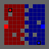

# Capture The Flag With Multi Agents

Vi har skapat ett environment i Capture The Flag där vi kan träna agenter som både har roller som defender och attacker 2v2.
Banorna är slumpade varje gång och alla i vår grupp har samma förutsättningar men har möjlighet att konfigurera egna rewards på olika beteenden.

### Exempel på en match

## Mitt Bidrag

Jag fick vara med att lägga till en wrapper för all reward policy. Den finns under . Detta var för att enkelt se och få en dashboard för all rewards man kunde tweaka.

## Mål
Målet för gruppen var att var för sig träna sin egen modell som sedan skulle möta varandra och se vem som hade den bästa hyperparametrarna.

## Slutsats
Vi insåg att det var svårt att balansera rewards för att den skulle prestera bra. Sedan i efterhand verkar det vara så att modellen har för lite information för att den ska kunna tolka sin omgivning.
T.ex. Skulle den behöva mer minne men det skulle orsaka mer träningstid och en mindre effektiv modell. Alternativt kunde man ge den en datapunkt där den alltid kunde veta vart sin hembas var men det skulle orsaka väldigt mycket bias i spelmiljön.
Man skulle också kunna byta ut intermediary rewards mot enstaka rewards som kör backpropagation på en lyckad serie events.
